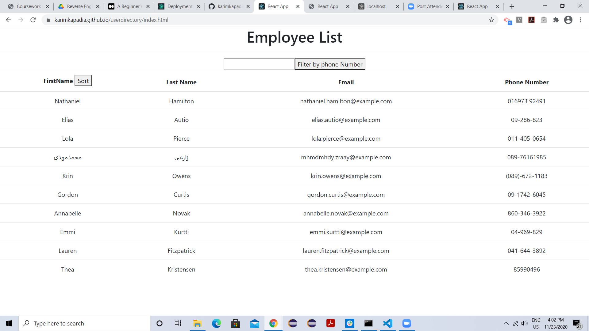
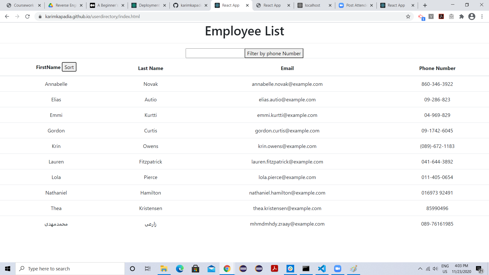
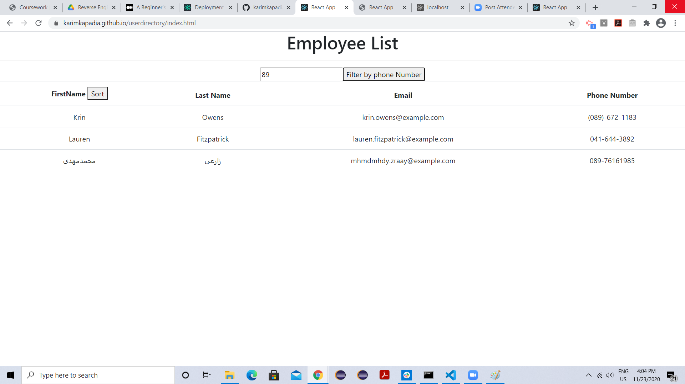

# User Directory with React
This is a user directory with react. User will be able to view my  employee directory at once so that I have quick access to their information.
user can sort the table by first name and can filter the records with phone number field.

# Images

# Links
Github link: https://github.com/karimkapadia/userdirectory

Github pages deployed link: https://karimkapadia.github.io/userdirectory/

